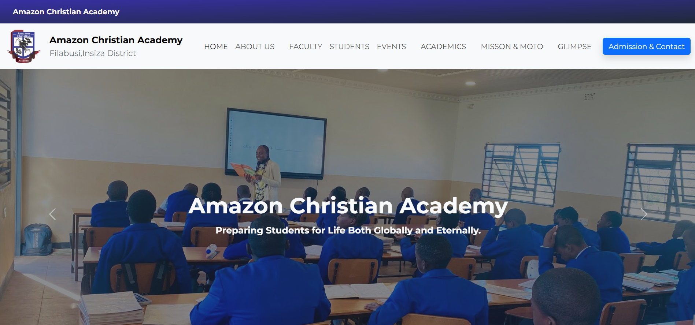

# School Website

Welcome to the Amazon Christian Academy School Website project! This project is designed to provide a modern and engaging online presence for the school, featuring components such as About Us, Glimpse, Contact Information, and more. Built with React and Vite, this application delivers a seamless user experience with modern design aesthetics.

## 📸 Screenshots



## 🚀 Installation

Follow these steps to set up and run the project on your local machine.

### 1. Clone the Repository

Clone the repository to your local machine using Git:

```bash
git clone https://github.com/Nqabasikeyi/ACA.git
cd your-repository
```

### 2. Install Dependencies

Ensure you have [Node.js](https://nodejs.org/) installed. Then, install the project dependencies using:

```bash
npm install
```

or

```bash
yarn install
```


### 3. Run the Development Server

Start the development server using:

```bash
npm run dev
```

or

```bash
yarn dev
```

Your application will be available at `http://localhost:5173`.

## 📦 Usage

Navigate through the following sections of the website:

- **Home Page**: Features an introduction to the school with a modern layout.
- **About Us**: Provides information about the school's mission, vision, and values.
- **Glimpse**: Highlights the school's history with a beautiful timeline.
- **Contact Us**: Includes a contact form, office hours, location map, and admission details.

### Contact Form

The contact form uses [EmailJS](https://www.emailjs.com/) for sending emails. Ensure you configure your email service correctly in the `.env` file.


## 📝 Acknowledgements

- **React**: A JavaScript library for building user interfaces.
- **Vite**: A fast build tool for modern web projects.
- **Tailwind CSS**: A utility-first CSS framework for designing beautiful interfaces.


